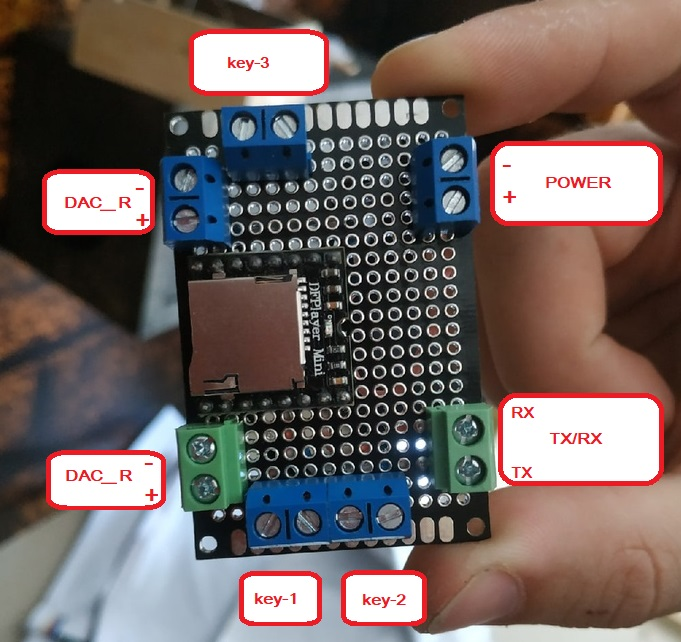
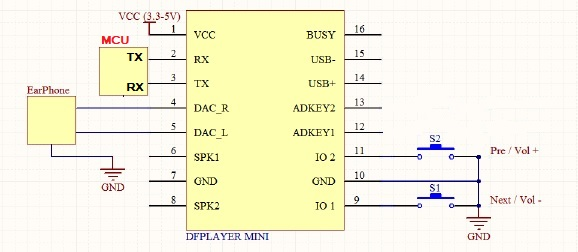

# mp3 плеер "DFPlayer mini"

## Подключение
Порт | Назначение
---|---
key-1 | Короткое нажатие - предыдущий трек   Длинное нажатие - уменьшение громкости
key-2 | Короткое нажатие - следующий трек   Длинное нажатие - увеличение громкости
key-3 | Не подключена
DAC_R | Выход на правый динамик
DAC_L | Выход на левый динамик 
POWER | Входное напряжение 3.2-5.0 В
TX/RX | Выход на последовательный порт подключения к контроллеру

Принцип подключение отображен на картинке ниже

Принципиальная схема
